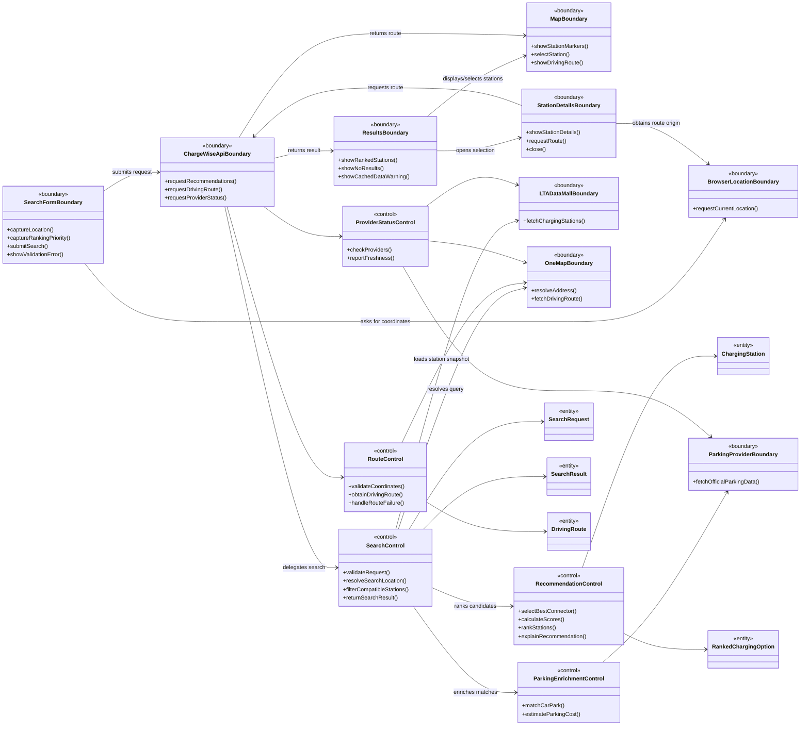

# ChargeWise SG - Key Boundary and Control Classes

## BCE collaboration overview

The boundary-control-entity split below separates user and provider interaction from application coordination and domain data. These are analysis classes: their names describe responsibilities and need not map one-to-one to source files.

## Key boundary classes

| Boundary class            | Responsibility                                                                                      | Main collaborators                                               |
| ------------------------- | --------------------------------------------------------------------------------------------------- | ---------------------------------------------------------------- |
| `SearchFormBoundary`      | Captures an address/postal code or current location and a ranking priority; displays input errors.  | `BrowserLocationBoundary`, `ChargeWiseApiBoundary`               |
| `ResultsBoundary`         | Presents ranked station cards, best-match information, empty states, and cached-data warnings.      | `ChargeWiseApiBoundary`, `MapBoundary`, `StationDetailsBoundary` |
| `MapBoundary`             | Presents the search centre, station markers, the selected station, and an optional route polyline.  | `ResultsBoundary`, `RouteControl`                                |
| `StationDetailsBoundary`  | Shows connector, price, parking, freshness, and travel details and lets the driver request a route. | `BrowserLocationBoundary`, `ChargeWiseApiBoundary`               |
| `BrowserLocationBoundary` | Encapsulates the browser permission flow and supplies current coordinates or an error.              | `SearchFormBoundary`, `StationDetailsBoundary`                   |
| `ChargeWiseApiBoundary`   | Represents the frontend/backend interface for recommendations, routes, and integration status.      | All frontend boundaries and backend controls                     |
| `LTADataMallBoundary`     | Translates LTA charging-station and availability data into domain entities.                         | `SearchControl`, `ProviderStatusControl`                         |
| `OneMapBoundary`          | Encapsulates Singapore address lookup and driving-route requests.                                   | `SearchControl`, `RouteControl`                                  |
| `ParkingProviderBoundary` | Encapsulates official URA and HDB/data.gov.sg parking sources.                                      | `ParkingEnrichmentControl`, `ProviderStatusControl`              |

## Key control classes

| Control class              | Responsibility                                                                                                                                 | Main entities                                      |
| -------------------------- | ---------------------------------------------------------------------------------------------------------------------------------------------- | -------------------------------------------------- |
| `SearchControl`            | Coordinates location resolution, live/cached station retrieval, compatibility filtering, parking enrichment, and the search response.          | `SearchRequest`, `ChargingStation`, `SearchResult` |
| `RecommendationControl`    | Selects a compatible connector, derives comparable measures, applies the selected ranking weights, sorts candidates, and creates explanations. | `ChargingStation`, `RankedChargingOption`          |
| `RouteControl`             | Obtains a OneMap road route between current location and a selected station and reports a clear failure when unavailable.                      | `DrivingRoute`, `ChargingStation`                  |
| `ParkingEnrichmentControl` | Conservatively associates an official car park and estimates cost only when its published tariff can be interpreted safely.                    | `ChargingStation`, `ParkingInformation`            |
| `ProviderStatusControl`    | Summarizes configuration, health, last success, errors, and cached-data freshness without exposing credentials.                                | `ProviderStatus`                                   |

## Traceability to the current codebase

| Analysis responsibility         | Current implementation anchor                         |
| ------------------------------- | ----------------------------------------------------- |
| Search and UI orchestration     | `ExplorePage`                                         |
| Results presentation            | `StationCard`, `MapPanel`, `StationDetailsModal`      |
| Frontend/backend boundary       | `api.ts`                                              |
| Station retrieval and filtering | `StationsController`, `StationsService`               |
| Recommendation ranking          | `RecommendationsController`, `RecommendationsService` |
| Route handling                  | `RoutesController`, `OneMapService`                   |
| Parking matching and estimation | `ParkingService` and provider services                |
| Integration health              | `IntegrationsController` and provider status methods  |
