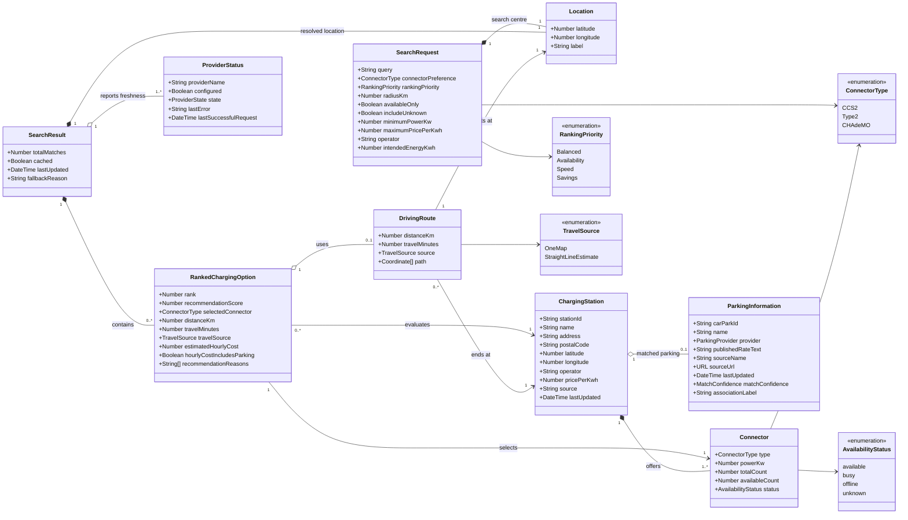

# ChargeWise SG - Entity Class Diagram

## Purpose and scope

This initial conceptual model captures the domain information needed to find, rank, inspect, and route to compatible EV charging stations. It reflects the current ChargeWise SG search-and-route scope: data is transient, and the system has no user accounts, reservations, payments, or charging history.

## Entity class diagram

## Relationship notes

- A `ChargingStation` owns one or more `Connector` records because availability, power, and status belong to a particular connector type.
- `ParkingInformation` is optional. An uncertain car-park match is omitted rather than treated as free parking.
- A `RankedChargingOption` evaluates one station using one selected connector. It stores derived values and explanations without changing the source station data.
- A `DrivingRoute` is optional because ChargeWise can still rank a station using a clearly labelled straight-line estimate when a OneMap road route is unavailable.
- `ProviderStatus` records whether displayed information is live, cached, unavailable, or not configured.

## Modelling assumptions

- Monetary and time estimates may be unknown; nullable numeric attributes must not silently become zero.
- Availability is a time-stamped snapshot, not a reservation or guarantee.
- Search requests, results, routes, and provider snapshots exist only for the current application session.
