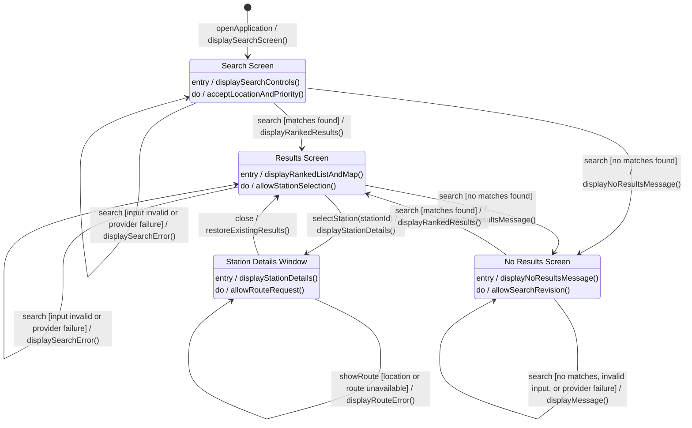

# ChargeWise SG - Initial Dialog Map

## Scope

This UML state machine models the user-visible navigation for finding, reviewing, and routing to a charging station. Each state represents a stable screen or window. Transition labels use the UML form `event [guard] / action`; loading, validation, cached-data warnings, and provider failures are actions or display outcomes rather than separate dialogs.

## Dialog map

## State descriptions

| State                  | User-visible content and permitted actions                                                                                                                                                                              |
| ---------------------- | ----------------------------------------------------------------------------------------------------------------------------------------------------------------------------------------------------------------------- |
| `SearchScreen`         | Location input, ranking-priority selector, current-location control, Search button, and initial guidance. The user can enter or obtain a location and start a search.                                                   |
| `ResultsScreen`        | Ranked station cards and selectable map markers, with the best match identified. A cached-data warning may appear without changing the current dialog. The user can revise the search or select a station.              |
| `NoResultsScreen`      | The search controls remain available with a no-compatible-stations message. The user can revise the location or ranking priority and search again.                                                                      |
| `StationDetailsWindow` | A modal window containing station, connector, availability, charging price, parking, travel, source, and freshness information. The user can request or change a route, retry after a route error, or close the window. |

## Navigation rules and constraints

- Only stable user-visible screens or windows are modeled as states.
- Loading indicators, validation messages, cached-data warnings, and route errors do not create new dialogs; they are feedback within the active screen or window.
- Selecting a station opens its details window but does not reserve the charger.
- Closing the station details window restores the existing ranked results without repeating the search.
- Requesting a route keeps the station details window active whether the request succeeds or fails.
- Starting another successful search replaces the previous ranked results and clears any station-specific route.
- Provider-health polling updates the status indicator without changing the active dialog.
