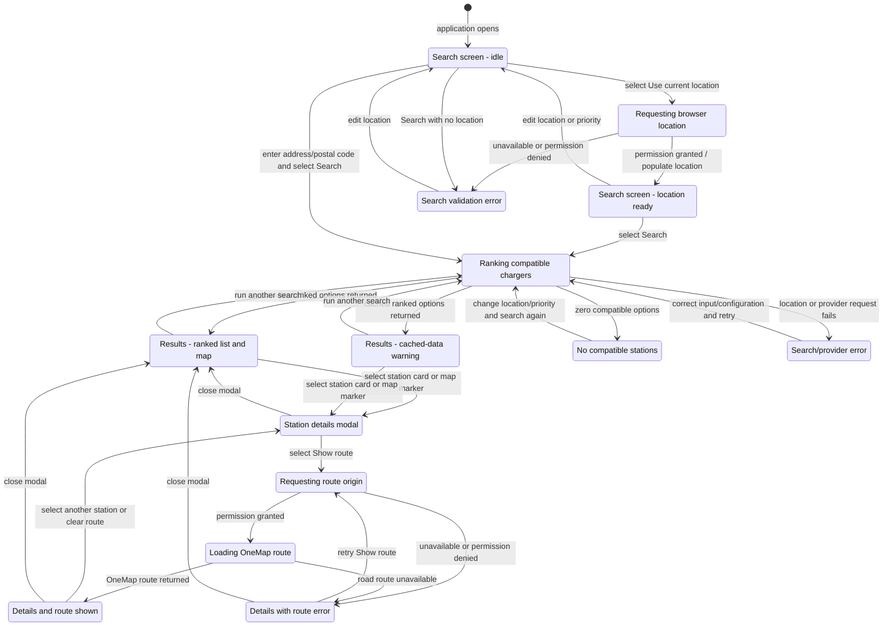

# ChargeWise SG - Initial Dialog Map

## Scope

This state machine models the current user-interface flow for searching, reviewing, and routing to a charging station. It is an initial Lab 2 dialog map and should be refined alongside the UI and conceptual model in Lab 3.

## Dialog map

## Dialog/state descriptions

| State                   | UI content and permitted actions                                                                                         |
| ----------------------- | ------------------------------------------------------------------------------------------------------------------------ |
| `SearchIdle`            | Location input, ranking-priority selector, current-location button, Search button, and provider indicator.               |
| `GettingSearchLocation` | Browser permission is pending; success fills the location field, while failure displays an actionable message.           |
| `Searching`             | Loading feedback explains that compatible chargers are being ranked by savings, speed, and availability.                 |
| `Results`               | Ranked cards and map markers are displayed; the best match is identified and either representation may select a station. |
| `CachedResults`         | The normal result interactions remain available, with a visible snapshot timestamp and fallback reason.                  |
| `NoResults`             | The interface explains that no compatible station was found and invites a revised search.                                |
| `Details`               | A modal displays station, connector, availability, charging, parking, travel, source, and freshness information.         |
| `LoadingRoute`          | Current coordinates and the selected station are sent for a OneMap driving route.                                        |
| `RouteShown`            | Route distance, travel time, and road geometry are shown in the modal/map context.                                       |
| `RouteError`            | The modal remains open and clearly states why a route could not be displayed, allowing retry or close.                   |

## Navigation rules and constraints

- Selecting a station does not reserve it; availability remains a snapshot.
- Search errors and route errors are separate so a route failure does not discard valid station results.
- Closing the details modal returns to the existing ranked results without repeating the search.
- A new search clears any previously selected route and station-specific route error.
- Provider-health polling updates the top-bar status without changing the driver's current dialog state.
